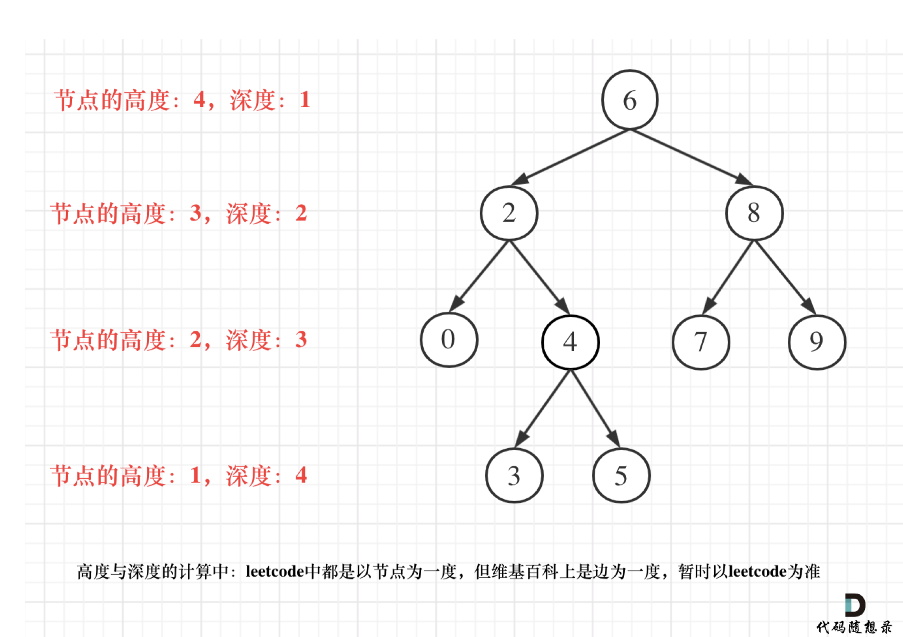

# [104. Maximum Depth of Binary Tree](https://leetcode.com/problems/maximum-depth-of-binary-tree/)
Given the <code>root</code> of a binary tree, return _its maximum depth_.

A binary tree&#39;s **maximum depth** is the number of nodes along the longest path from the root node down to the farthest leaf node.

**Example 1:**

<pre><strong>Input:</strong> root = [3,9,20,null,null,15,7]
<strong>Output:</strong> 3
</pre>

**Example 2:**

<pre><strong>Input:</strong> root = [1,null,2]
<strong>Output:</strong> 2
</pre>

**Example 3:**

<pre><strong>Input:</strong> root = []
<strong>Output:</strong> 0
</pre>

**Example 4:**

<pre><strong>Input:</strong> root = [0]
<strong>Output:</strong> 1
</pre>

**Constraints:**

- The number of nodes in the tree is in the range <code>[0, 104]</code>.
- <code>-100 &lt;= Node.val &lt;= 100</code>

##  解题思路

1. recursive
   基本上就是計算左右子樹 count, 再取 Max

2. iteration
   層序遍歷，每一個 level 加1即可

3. 計算深
   > ⼆叉樹節點的深度：指從根節點到該節點的最⻓簡單路徑邊的條數。
   > ⼆叉樹節點的⾼度：指從該節點到葉⼦節點的最⻓簡單路徑邊的條數。

   

   在 recursive func 中代入 depth, res, 每往下走+1，往回走-1，當前 depth > res，更新 res

##  可能的變化

