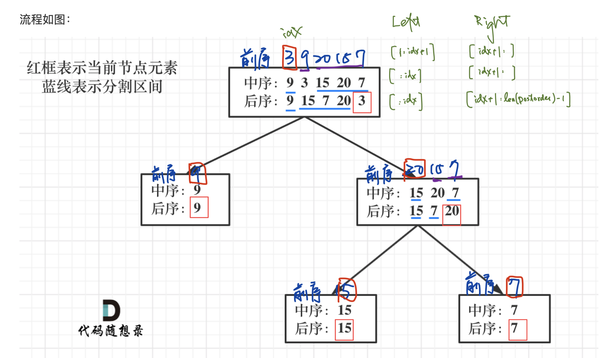

# [105. Construct Binary Tree from Preorder and Inorder Traversal](https://leetcode.com/problems/construct-binary-tree-from-preorder-and-inorder-traversal/)
Given two integer arrays <code>preorder</code> and <code>inorder</code> where <code>preorder</code> is the preorder traversal of a binary tree and <code>inorder</code> is the inorder traversal of the same tree, construct and return _the binary tree_.

**Example 1:**

<pre><strong>Input:</strong> preorder = [3,9,20,15,7], inorder = [9,3,15,20,7]
<strong>Output:</strong> [3,9,20,null,null,15,7]
</pre>

**Example 2:**

<pre><strong>Input:</strong> preorder = [-1], inorder = [-1]
<strong>Output:</strong> [-1]
</pre>

**Constraints:**

- <code>1 &lt;= preorder.length &lt;= 3000</code>
- <code>inorder.length == preorder.length</code>
- <code>-3000 &lt;= preorder[i], inorder[i] &lt;= 3000</code>
- <code>preorder</code> and <code>inorder</code> consist of **unique** values.
- Each value of <code>inorder</code> also appears in <code>preorder</code>.
- <code>preorder</code> is **guaranteed** to be the preorder traversal of the tree.
- <code>inorder</code> is **guaranteed** to be the inorder traversal of the tree.

##  解题思路

使用前序中序來重建一顆二叉樹，106 是使用後序中序來重建一顆二叉樹。
前序的第一個就是根節點，再拿跟節點來求中序的位置，可以拿到左右子樹，之後遞迴

##  可能的變化

