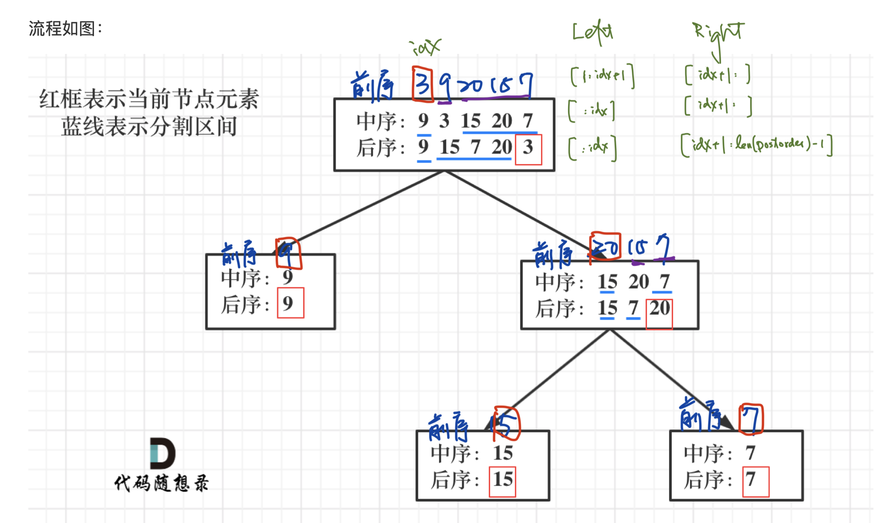

# [106. Construct Binary Tree from Inorder and Postorder Traversal](https://leetcode.com/problems/construct-binary-tree-from-inorder-and-postorder-traversal/)
Given two integer arrays <code>inorder</code> and <code>postorder</code> where <code>inorder</code> is the inorder traversal of a binary tree and <code>postorder</code> is the postorder traversal of the same tree, construct and return _the binary tree_.

**Example 1:**

<pre><strong>Input:</strong> inorder = [9,3,15,20,7], postorder = [9,15,7,20,3]
<strong>Output:</strong> [3,9,20,null,null,15,7]
</pre>

**Example 2:**

<pre><strong>Input:</strong> inorder = [-1], postorder = [-1]
<strong>Output:</strong> []
</pre>

**Constraints:**

- <code>1 &lt;= inorder.length &lt;= 3000</code>
- <code>postorder.length == inorder.length</code>
- <code>-3000 &lt;= inorder[i], postorder[i] &lt;= 3000</code>
- <code>inorder</code> and <code>postorder</code> consist of **unique** values.
- Each value of <code>postorder</code> also appears in <code>inorder</code>.
- <code>inorder</code> is **guaranteed** to be the inorder traversal of the tree.
- <code>postorder</code> is **guaranteed** to be the postorder traversal of the tree.

##  解题思路

使用後序中序來重建一顆二叉樹， 105 是使用前序中序來重建一顆二叉樹
後序的最後一個就是根節點，再拿跟節點來求中序的位置，可以拿到左右子樹，之後遞迴

##  可能的變化

